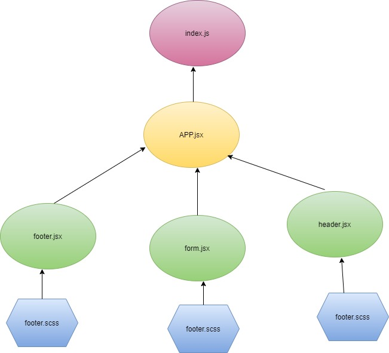

# RESTy
* As a user, I expect an easy to read and understand user interface so that I can use the application intuitively
* As a user, I want to enter the URL to a REST API and select the REST method to use to access it
* As a user, I want visual confirmation that my entries and selections are valid so that I have confidence the application will be able to fetch the API data that I’ve requested

## links

* [Repo link](https://github.com/engnour94/resty)
* [Heroku](https://resty-by-nour.herokuapp.com)

## UML
