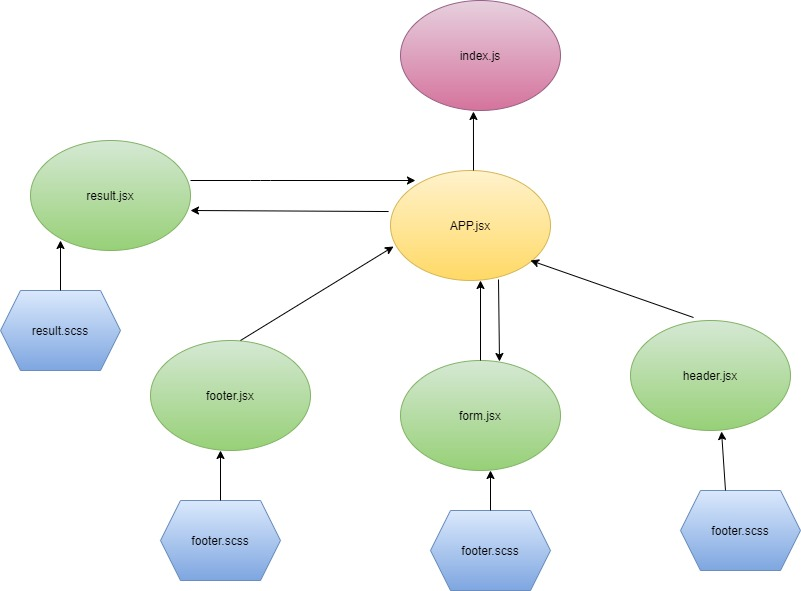
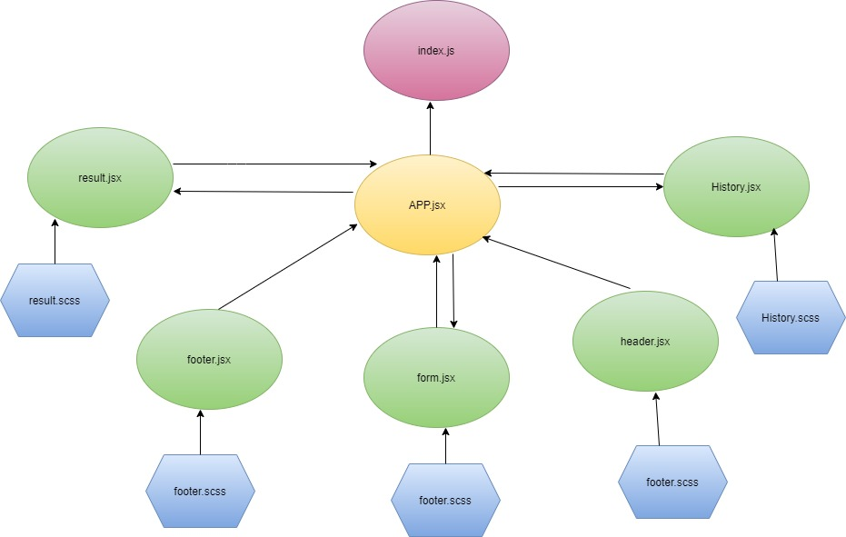

# RESTy

In phase 2, we will be connecting RESTy to live APIs, fetching and displaying remote data. Our primary focus will be to service GET requests

The following user stories detail the major functionality for this phase of the project.

As a user, I want to enter the URL to an API and issue a GET request so that I can retrieve it’s data
As a user, I want to see the results returned from an API request in my browser in a readable format

## links

* [Repo link](https://github.com/engnour94/resty)
* [Heroku](https://engnour94.github.io/resty/)

## UML

## Phase 3 Requirements

In this phase of the RESTy build, we will be adding some more fidelity to the application, including a menu, history, and an “in-progress” spinner.

The following user stories detail the major functionality for this phase of the project.

* As a user, I want to be able to use all REST methods so that I can do more than just get data
* As a user, I want a simple list of all previous queries I’ve run so that I can easily see which queries I’ve run before
* As a user, I want to click on an old query and have my selections appear in the form for me, so I don’t have to re-type them
* As a user, I want to see a “loading” indicator while RESTy is fetching data so that I know it’s working on my request

## UML

## links

* [Repo link](https://github.com/engnour94/resty)
* [not deployed yet]()

## Phase 4 Requirements
In this final phase of the RESTy build, we will be adding some more fidelity to the application, including a menu with a ore detailed view of our history, as well as an about us page.

The following user stories detail the major functionality for this phase of the project.

As a user, I want to see all of my previous queries as a separate page so that I can browse them in greater detail
As a user, I would like to view a separate “Help” page so I can learn how the application works

## UML

## links

* [Repo link](https://github.com/engnour94/resty)
* [ deployed link](https://engnour94.github.io/resty/)
